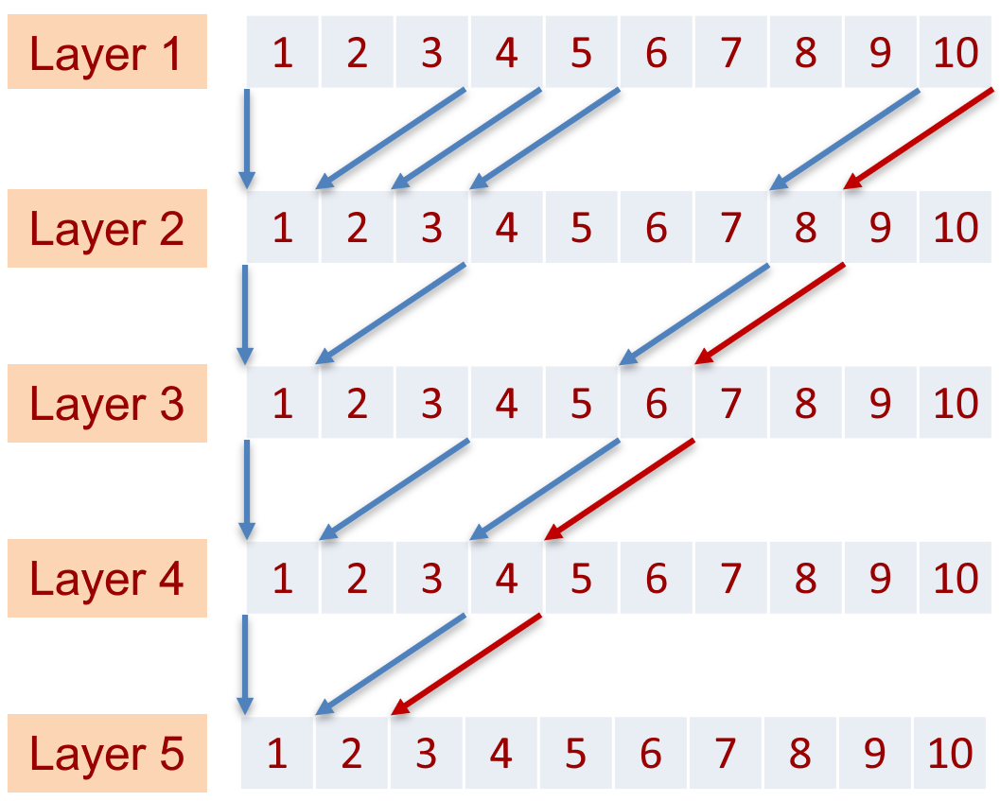

# LMUFormer: Low Complexity Yet Powerful Spiking Model With Legendre Memory Units, [ICLR 2024](https://openreview.net/forum?id=oEF7qExD9F&referrer=%5BAuthor%20Console%5D(%2Fgroup%3Fid%3DICLR.cc%2F2024%2FConference%2FAuthors%23your-submissions))

> 鹏北海，凤朝阳。又携书剑路茫茫。明年此日青云去，却笑人间举子忙。


## Citing
Please consider citing our paper if you find this repository useful.
```
Awaiting publication on arXiv
```

## Overall structure of our LMUFormer:

<p align="center">
  
</p>

## Details of the Conv1d patch embedding module and the spiking LMU block.
<p align="center">
  
  
</p>

## Delay analysis of the convolutional patch embedding and the plot of test accuracy as the number of samples in the sequence increses.

<p align="center">
  
  
</p>


## Directory Structure

- 📂 **LMUFormer**
    - 📂 **data/**
        - 📜 `prep_sc.py` download and preprocess the Google Speech Commands V2 dataset
    - 📂 **src**
        - 📂 **blocks**
            - 📜 `conv1d_embedding.py` three types of Conv1d embedding modules
            - 📜 `lmu_cell.py` the original LMU cell and the spiking version of LMU cell
            - 📜 `lmu.py` three types of LMU modules and the self-attention module
            - 📜 `mlp.py` four types of MLP modules 
        - 📂 **utilities**
            - 📜 `stats.py` 
            - 📜 `util.py` 
        - 📂 **logs**
        - 📜 `dataloader.py` 
        - 📜 `gsc.yml` the hyper-patameters configuration file
        - 📜 `lmu_rnn.py` register 3 types of LMUFormer model and one spiking Transformer model
        - 📜 `run.py`
        - 📜 `traintest.py` 
    - 📜 `requirements.txt` configuration for cifar10 dataset
    - 📜 `README.md` configuration for imagenet100 dataset


## Requirements

To run our code, please install the dependency packages in the `requirements.txt` as following:
```
pip install -r requirements.txt
```

## Prepare Dataset
```
cd data/speech_commands
python prep_sc.py
```

## Run the Model
```
cd src
python run.py
```

## Test the Model in seq mode
To test our LMUFormer model on a sample-by-sample basis, simply add `test_only: True` and `test_mode: all_seq` to the `gsc.yml` file. Then, set `initial_checkpoint` to your trained LMUFormer model. This will reproduce the final accuracy result found in the original log file at the end of the test. Additionally, a file named acc_list.pkl will be generated. You can use the code provided below to plot the accuracy as it relates to the increasing number of samples in the sequence.
```
import pickle
import matplotlib.pyplot as plt

with open('acc_list.pkl', 'rb') as f:
    acc_list = pickle.load(f)
plt.plot(acc_list)
plt.xlabel('Sequence #')
plt.ylabel('Acc.(%)')
plt.legend()
```

## References
The code for this project references the following previous work:

[AST: Audio Spectrogram Transformer](https://github.com/YuanGongND/ast)

[PyTorch LMU](https://github.com/hrshtv/pytorch-lmu)